# 📊 Modelagem e Engenharia de Banco de Dados: Despesas Públicas (TCE-PB 2025)

[](https://www.mysql.com/)
[](https://www.docker.com/)
[](https://www.phpmyadmin.net/)
[](https://dev.mysql.com/downloads/workbench/)
[](https://en.wikipedia.org/wiki/Star_schema)

Projeto de modelagem dimensional (**Star Schema**) e implementação de banco de dados relacional normalizado até a **3ª Forma Normal (3FN)**, desenvolvido a partir dos microdados públicos de despesas orçamentárias do **Tribunal de Contas do Estado da Paraíba (TCE-PB)** para o **1º Semestre de 2025**.

O projeto contempla a concepção do modelo lógico e dimensional (EER), estratégias robustas de tratamento e mitigação de inconsistências/nulos, orquestração de infraestrutura conteinerizada via **Docker Compose** e um pipeline completo de extração, carga (ELT), normalização e validação/auditoria executado diretamente em SQL puro com alto desempenho no motor MySQL.

---

## 📌 Sumário

- [Origem dos Dados](#-origem-dos-dados)
- [Arquitetura de Infraestrutura (Docker)](#-arquitetura-de-infraestrutura-docker)
- [Arquitetura e Modelo Lógico (EER)](#-arquitetura-e-modelo-lógico-eer)
- [Dicionário de Tabelas e Entidades](#-dicionário-de-tabelas-e-entidades)
- [Relacionamentos e Chaves](#-relacionamentos-e-chaves)
  - [Justificativa da Surrogate Key (`id_fato`)](#justificativa-da-surrogate-key-id_fato)
  - [Mapeamento dos Vínculos (1:N Não-Identificadores)](#mapeamento-dos-vínculos-1n-não-identificadores)
- [Estratégia de Mitigação de Valores Nulos](#️-estratégia-de-mitigação-de-valores-nulos)
- [Pipeline de Carga e Normalização via SQL](#-pipeline-de-carga-e-normalização-via-sql)
  - [Visão Geral dos Scripts SQL](#visão-geral-dos-scripts-sql)
- [Guia de Execução Passo a Passo](#-guia-de-execução-passo-a-passo)
  - [1. Pré-requisitos](#1-pré-requisitos)
  - [2. Download e Extração da Base Bruta](#2-download-e-extração-da-base-bruta)
  - [3. Iniciar o Ambiente de Banco de Dados](#3-iniciar-o-ambiente-de-banco-de-dados)
  - [4. Copiar o CSV para a Pasta Segura do MySQL](#4-copiar-o-csv-para-a-pasta-segura-do-mysql)
  - [5. Executar os Scripts de Criação e Carga](#5-executar-os-scripts-de-criação-e-carga)
  - [6. Validação e Auditoria dos Dados (`check_data.sql`)](#6-validação-e-auditoria-dos-dados-check_datasql)
- [Estrutura do Repositório](#-estrutura-do-repositório)
  - [Visão em Árvore](#visão-em-árvore)
  - [Organização e Papel das Pastas](#organização-e-papel-das-pastas)

---

## 🌐 Origem dos Dados

Os microdados foram obtidos através do portal de transparência e dados abertos do **Tribunal de Contas do Estado da Paraíba (TCE-PB)**:

* **Portal**: [TCE-PB Dados Abertos - Dados Consolidados](https://dados-abertos.tce.pb.gov.br/dados-consolidados)
* **Dataset**: Despesas consolidadas do exercício de 2025 (`despesas-2025.csv`).
* **Volume Original Bruto**: **2.387.532 linhas** e **40 colunas** desnormalizadas (~1.95 GB).
* **Recorte Analítico**: **1º Semestre de 2025** (Janeiro a Junho — **1.068.148 registros válidos**).

> [!NOTE]
> O recorte temporal para o 1º semestre viabiliza um ciclo completo de auditoria fiscal e contábil, permitindo analisar execuções orçamentárias consolidadas mantendo estabilidade de processamento e alta performance transacional.

---

## 🐳 Arquitetura de Infraestrutura (Docker)

O ambiente de banco de dados e a interface administrativa são provisionados via **Docker Compose**, garantindo ambiente isolado, reprodutível e persistente.

### Serviços Configurados

| Serviço | Imagem | Porta Host:Container | Descrição |
| :--- | :--- | :---: | :--- |
| **`db`** (`mysql_modelagem`) | `mysql:8.0` | `3307:3306` | SGBD Relacional MySQL 8.0 com suporte a volumes persistentes |
| **`phpmyadmin`** (`phpmyadmin_modelagem`) | `phpmyadmin:latest` | `8080:80` | Interface Web para gestão, execução de queries e visualização |

### Credenciais de Conexão

* **Host**: `localhost` (ou `127.0.0.1`)
* **Porta MySQL**: `3307`
* **Banco de Dados**: `modelagem`
* **Usuário da Aplicação**: `usuario` | **Senha**: `senhasegura`
* **Usuário Administrativo**: `root` | **Senha**: `rootpassword`
* **Painel phpMyAdmin**: [http://localhost:8080](http://localhost:8080)
* **Volume Persistente**: `mysql_data` montado em `/var/lib/mysql`

---

## 📐 Arquitetura e Modelo Lógico (EER)

A base transacional desnormalizada original (tabela plana com 40 atributos) apresentava anomalias de redundância funcional e dependências transitivas. 

O modelo foi projetado sob a arquitetura de **Esquema Estrela (Star Schema)**, composto por **1 tabela fato central (`fato_empenhos`)** cercada por **13 tabelas de dimensão** desacopladas e normalizadas até a **3ª Forma Normal (3FN)**.

O arquivo editável do modelo conceitual/lógico está disponível em:
📁 [`src/modelo_despesas_2025_1semestre.mwb`](file:///c:/Users/eu/Documents/GitHub/modelagem/src/modelo_despesas_2025_1semestre.mwb)

```mermaid
erDiagram
    fato_empenhos }o--|| dim_credor : "cpf_cnpj"
    fato_empenhos }o--|| dim_unidade_gestora : "codigo_unidade_gestora"
    fato_empenhos }o--|| dim_unidade_orcamentaria : "codigo_unidade_orcamentaria"
    fato_empenhos }o--|| dim_funcao : "codigo_funcao"
    fato_empenhos }o--|| dim_subfuncao : "codigo_subfuncao"
    fato_empenhos }o--|| dim_programa : "codigo_programa"
    fato_empenhos }o--|| dim_acao : "codigo_acao"
    fato_empenhos }o--|| dim_categoria_economica : "codigo_categoria_economica"
    fato_empenhos }o--|| dim_natureza : "codigo_natureza"
    fato_empenhos }o--|| dim_modalidade_aplicacao : "codigo_modalidade_aplicacao"
    fato_empenhos }o--|| dim_elemento_despesa : "codigo_elemento_despesa"
    fato_empenhos }o--|| dim_fonte_recurso : "codigo_fonte_recurso"
    fato_empenhos }o--|| dim_co : "co"

    fato_empenhos {
        bigint id_fato PK "Surrogate Key (AUTO_INCREMENT)"
        bigint numero_empenho
        datetime data_empenho
        string mes
        double codigo_unidade_gestora FK
        bigint codigo_unidade_orcamentaria FK
        bigint cpf_cnpj FK
        bigint codigo_funcao FK
        bigint codigo_subfuncao FK
        bigint codigo_programa FK
        bigint codigo_acao FK
        bigint codigo_categoria_economica FK
        bigint codigo_natureza FK
        bigint codigo_modalidade_aplicacao FK
        bigint codigo_elemento_despesa FK
        bigint codigo_subelemento
        string codigo_subelemento_exibicao
        bigint codigo_fonte_recurso FK
        double co FK
        bigint numero_licitacao
        string modalidade_licitacao
        bigint numero_obra
        double valor_empenhado
        double valor_liquidado
        double valor_pago
        string historico
        bigint ano_fonte
    }

    dim_credor {
        bigint cpf_cnpj PK
        string nome_credor
    }

    dim_unidade_gestora {
        double codigo_unidade_gestora PK
        string descricao_unidade_gestora
        string municipio
    }

    dim_unidade_orcamentaria {
        bigint codigo_unidade_orcamentaria PK
        string descricao_unidade_orcamentaria
    }

    dim_funcao {
        bigint codigo_funcao PK
        string funcao
    }

    dim_subfuncao {
        bigint codigo_subfuncao PK
        string subfuncao
    }

    dim_programa {
        bigint codigo_programa PK
        string programa
    }

    dim_acao {
        bigint codigo_acao PK
        string acao
    }

    dim_categoria_economica {
        bigint codigo_categoria_economica PK
        string categoria_economica
    }

    dim_natureza {
        bigint codigo_natureza PK
        string grupo_natureza_despesa
    }

    dim_modalidade_aplicacao {
        bigint codigo_modalidade_aplicacao PK
        string modalidade_aplicacao
    }

    dim_elemento_despesa {
        bigint codigo_elemento_despesa PK
        string elemento_despesa
    }

    dim_fonte_recurso {
        bigint codigo_fonte_recurso PK
        string descricao_fonte_recurso
    }

    dim_co {
        double co PK
        string descricao_co
    }
```



---

## 📋 Dicionário de Tabelas e Entidades

Após a execução do pipeline de modelagem e normalização no 1º semestre de 2025, o banco consolida **14 tabelas**:

| Tabela | Tipo | Quantidade de Registros | Chave Primária (PK) | Descrição do Domínio |
| :--- | :---: | :---: | :--- | :--- |
| **`fato_empenhos`** | **Fato** | **1.068.148** | `id_fato` | Eventos transacionais de despesa, métricas financeiras e chaves estrangeiras |
| **`dim_credor`** | Dimensão | 168.771 | `cpf_cnpj` | Pessoas físicas, jurídicas e entidades favorecidas dos pagamentos |
| **`dim_acao`** | Dimensão | 1.104 | `codigo_acao` | Ações orçamentárias (projetos, atividades ou operações especiais) |
| **`dim_unidade_gestora`** | Dimensão | 622 | `codigo_unidade_gestora` | Entidades, órgãos públicos e respectivos municípios de atuação |
| **`dim_unidade_orcamentaria`** | Dimensão | 519 | `codigo_unidade_orcamentaria` | Subdivisões orçamentárias executoras dos recursos |
| **`dim_programa`** | Dimensão | 513 | `codigo_programa` | Programas de governo definidos no Plano Plurianual (PPA) |
| **`dim_subfuncao`** | Dimensão | 88 | `codigo_subfuncao` | Partições das funções de governo |
| **`dim_fonte_recurso`** | Dimensão | 64 | `codigo_fonte_recurso` | Mecanismos de financiamento e origem dos recursos públicos |
| **`dim_elemento_despesa`** | Dimensão | 50 | `codigo_elemento_despesa` | Desdobramento dos objetos de gasto (ex: serviços, material de consumo) |
| **`dim_funcao`** | Dimensão | 26 | `codigo_funcao` | Maior nível de agregação das áreas de atuação pública (ex: Saúde, Educação) |
| **`dim_co`** | Dimensão | 15 | `co` | Códigos de Operação vinculados ao controle de destinação orçamentária |
| **`dim_modalidade_aplicacao`** | Dimensão | 14 | `codigo_modalidade_aplicacao` | Especificação de aplicação direta ou transferências a outras esferas |
| **`dim_natureza`** | Dimensão | 6 | `codigo_natureza` | Agrupamento orçamentário (Despesas Correntes, Despesas de Capital, etc.) |
| **`dim_categoria_economica`** | Dimensão | 2 | `codigo_categoria_economica` | Classificação macroeconômica da despesa pública |

---

## 🔗 Relacionamentos e Chaves

### Justificativa da Surrogate Key (`id_fato`)

Na contabilidade pública estadual e municipal, o atributo `numero_empenho` **não constitui um identificador universal único**:
1. **Reinício de Numeração Periódica**: Cada município e cada unidade gestora reinicia a numeração de seus empenhos a partir de `1` a cada novo exercício orçamentário.
2. **Multiplicidade do Empenho**: Um mesmo empenho pode registrar múltiplos desdobramentos de subelementos de despesa, fontes de recursos e parcelas de liquidação/pagamento dentro do mesmo órgão.
3. **Desempenho e Integridade Relacional**: Chaves compostas excessivamente amplas (`codigo_unidade_gestora`, `numero_empenho`, `data_empenho`, `codigo_subelemento`, etc.) comprometeriam os custos de indexação e *joins*.

> [!IMPORTANT]
> A adoção da **Surrogate Key sintética `id_fato` (`BIGINT AUTO_INCREMENT`)** como Chave Primária exclusiva da tabela fato assegura atomicidade estrita, integridade referencial de alta performance e preserva a rastreabilidade original das chaves de negócio contábeis.

### Mapeamento dos Vínculos (1:N Não-Identificadores)

Todas as 13 dimensões relacionam-se com a tabela fato através de vínculos de cardinalidade **1:N (Um para Muitos)** não-identificadores:

| Tabela Dimensão (Lado 1 - PK) | Coluna PK | Coluna FK na `fato_empenhos` (Lado N) | Restrição Relacional |
| :--- | :--- | :--- | :--- |
| **`dim_credor`** | `cpf_cnpj` (`BIGINT`) | `cpf_cnpj` | `ON DELETE NO ACTION ON UPDATE NO ACTION` |
| **`dim_unidade_gestora`** | `codigo_unidade_gestora` (`DOUBLE`) | `codigo_unidade_gestora` | `ON DELETE NO ACTION ON UPDATE NO ACTION` |
| **`dim_unidade_orcamentaria`** | `codigo_unidade_orcamentaria` (`BIGINT`) | `codigo_unidade_orcamentaria` | `ON DELETE NO ACTION ON UPDATE NO ACTION` |
| **`dim_funcao`** | `codigo_funcao` (`BIGINT`) | `codigo_funcao` | `ON DELETE NO ACTION ON UPDATE NO ACTION` |
| **`dim_subfuncao`** | `codigo_subfuncao` (`BIGINT`) | `codigo_subfuncao` | `ON DELETE NO ACTION ON UPDATE NO ACTION` |
| **`dim_programa`** | `codigo_programa` (`BIGINT`) | `codigo_programa` | `ON DELETE NO ACTION ON UPDATE NO ACTION` |
| **`dim_acao`** | `codigo_acao` (`BIGINT`) | `codigo_acao` | `ON DELETE NO ACTION ON UPDATE NO ACTION` |
| **`dim_categoria_economica`** | `codigo_categoria_economica` (`BIGINT`) | `codigo_categoria_economica` | `ON DELETE NO ACTION ON UPDATE NO ACTION` |
| **`dim_natureza`** | `codigo_natureza` (`BIGINT`) | `codigo_natureza` | `ON DELETE NO ACTION ON UPDATE NO ACTION` |
| **`dim_modalidade_aplicacao`** | `codigo_modalidade_aplicacao` (`BIGINT`) | `codigo_modalidade_aplicacao` | `ON DELETE NO ACTION ON UPDATE NO ACTION` |
| **`dim_elemento_despesa`** | `codigo_elemento_despesa` (`BIGINT`) | `codigo_elemento_despesa` | `ON DELETE NO ACTION ON UPDATE NO ACTION` |
| **`dim_fonte_recurso`** | `codigo_fonte_recurso` (`BIGINT`) | `codigo_fonte_recurso` | `ON DELETE NO ACTION ON UPDATE NO ACTION` |
| **`dim_co`** | `co` (`DOUBLE`) | `co` | `ON DELETE NO ACTION ON UPDATE NO ACTION` |

---

## 🛡️ Estratégia de Mitigação de Valores Nulos

Para eliminar violações de chave estrangeira, garantir consistência relacional e expurgar registros órfãos, foram aplicados tratamentos determinísticos para cada atributo durante a carga SQL:

| Coluna / Atributo | Comportamento na Base Bruta | Método de Tratamento SQL Adotado | Racional Técnico |
| :--- | :--- | :--- | :--- |
| **`data_empenho`** | Inconsistência de máscara de formatação no texto (`YYYY-MM-DD` vs `DD/MM/YYYY`) | `COALESCE(STR_TO_DATE(LEFT(data_empenho, 10), '%Y-%m-%d'), STR_TO_DATE(LEFT(data_empenho, 10), '%d/%m/%Y'))` | *Fallback* de máscara dupla garantindo conversão nativa para o tipo `DATETIME`. |
| **`co`** *(Cód. de Operação)* | ~73% de registros vazios (campo de preenchimento opcional no TCE) | Registro Sentinela (`co = 0`, `'Não Aplicável'`) e `COALESCE(CAST(NULLIF(co, '') AS DOUBLE), 0)` | Evita violações de chave estrangeira inserindo um registro sentinela canônico na dimensão. |
| **`codigo_unidade_gestora`** | ~0,28% de registros sem identificador de órgão gestor | Registro Sentinela (`codigo_unidade_gestora = 0`, `'Não Informado'`) e `COALESCE(..., 0)` | Preserva integridade de auditoria sem descartar lançamentos de despesa válidos. |
| **`valor_empenhado`**<br>**`valor_liquidado`**<br>**`valor_pago`** | Formatação textual em moeda brasileira (ex: `1.250,50`) | `COALESCE(CAST(REPLACE(REPLACE(NULLIF(col, ''), '.', ''), ',', '.') AS DOUBLE), 0.0)` | Sanitização de pontuação de milhar e substituição da vírgula decimal antes do *cast* numérico. |
| **`modalidade_licitacao`** | *Strings* vazias em compras diretas ou dispensas | `COALESCE(modalidade_licitacao, 'Sem Licitação')` | Padronização textual para categorização e consultas agregadas. |
| **`codigo_subelemento_exibicao`** | Omissão de descrição textual do subelemento | `COALESCE(codigo_subelemento_exibicao, 'SEM SUBELEMENTO')` | Tratamento de integridade textual descritiva. |
| **`ano_fonte`** | Registros residuais com campo nulo | `COALESCE(CAST(NULLIF(ano_fonte, '') AS SIGNED), 2025)` | Preenchimento automático com o ano-base de referência contábil. |
| **`historico`** | Valores nulos | `COALESCE(historico, '')` | Garantia de campo texto não-nulo para buscas textuais. |

---

## ⚙️ Pipeline de Carga e Normalização via SQL

O ciclo de vida do banco **dispensa scripts externos em lote ou dependências pesadas de bibliotecas de terceiros**, executando todo o processo de ELT, normalização e auditoria diretamente no motor MySQL através de scripts puros:

```
┌─────────────────────────────────────────────────────────────────────────┐
│                    Arquivo CSV Bruto: despesas-2025.csv                 │
│                          (2.387.532 linhas brutas)                      │
└────────────────────────────────────┬────────────────────────────────────┘
                                     │
                                     ▼  LOAD DATA INFILE
┌─────────────────────────────────────────────────────────────────────────┐
│                     Tabela Temporária: temp_despesas                    │
│                      (Staging com tipagem VARCHAR)                      │
└────────────────────────────────────┬────────────────────────────────────┘
                                     │
                                     ▼  DELETE WHERE mes > 6
┌─────────────────────────────────────────────────────────────────────────┐
│                  Filtro Temporal do 1º Semestre (2025)                  │
│                     (1.068.148 registros validados)                     │
└──────────────────┬──────────────────────────────────┬───────────────────┘
                   │                                  │
                   ▼                                  ▼
┌──────────────────────────────────────┐   ┌──────────────────────────────┐
│  INSERT IGNORE ... SELECT DISTINCT   │   │ INSERT INTO fato_empenhos    │
│  - Popula as 13 Tabelas Dimensão     │   │ - Conversão de tipos & casts │
│  - Cria registros sentinelas (cód 0) │   │ - Tratamento de nulos        │
│  - Normalização para 2FN e 3FN       │   │ - Geração de Surrogate Key   │
└──────────────────────────────────────┘   └──────────────────────────────┘
                                                          │
                                                          ▼  DROP TABLE
                                           ┌──────────────────────────────┐
                                           │    Limpeza de Staging        │
                                           │    Restauração de FKs/Checks │
                                           └──────────────┬───────────────┘
                                                          │
                                                          ▼  AUDITORIA
                                           ┌──────────────────────────────┐
                                           │ check_data.sql               │
                                           │ check_nulos.sql              │
                                           │ - Validação e Integridade    │
                                           └──────────────────────────────┘
```

### Visão Geral dos Scripts SQL

A pasta [`src/scripts/`](file:///c:/Users/eu/Documents/GitHub/modelagem/src/scripts/) reúne todos os scripts que coordenam a criação, manipulação e auditoria do banco:

1. **[`Create_Equipe_5_2026.2.sql`](file:///c:/Users/eu/Documents/GitHub/modelagem/src/scripts/Create_Equipe_5_2026.2.sql) (DDL - Definição)**:
   - Script gerado via *Forward Engineering* do MySQL Workbench.
   - Criação do esquema `modelagem` com suporte a `utf8mb4`.
   - Declaração formal das 14 tabelas, restrições de integridade referencial (`FOREIGN KEY`), chaves primárias e índices secundários (`INDEX`) otimizados para consulta analítica.

2. **[`Insert_Equipe_5_2026.2.sql`](file:///c:/Users/eu/Documents/GitHub/modelagem/src/scripts/Insert_Equipe_5_2026.2.sql) (DML - Carga e Normalização)**:
   - **Staging Table**: Criação de `temp_despesas` com tipos tolerantes a variações textuais.
   - **Ingestão Massiva**: Carga do CSV através de `LOAD DATA INFILE '/var/lib/mysql-files/despesas-2025.csv'` com delimitador `;`.
   - **Filtro Semestral**: Expurgador direto de dados fora do 1º semestre via `DELETE FROM temp_despesas WHERE CAST(LEFT(mes, 2) AS SIGNED) > 6`.
   - **Normalização Dimensional**: Comandos atômicos `INSERT IGNORE ... SELECT DISTINCT` para extração das 13 dimensões sem redundâncias.
   - **Carga Transacional Otimizada**: Desativação temporária de validações secundárias (`SET autocommit = 0; SET UNIQUE_CHECKS = 0; SET FOREIGN_KEY_CHECKS = 0;`), garantindo alta velocidade de inserção na `fato_empenhos`.
   - **Limpeza**: Descarte automático da tabela de staging (`DROP TABLE temp_despesas`) e restauração das restrições de integridade.

3. **[`check_data.sql`](file:///c:/Users/eu/Documents/GitHub/modelagem/src/scripts/check_data.sql) (DQL - Validação e Auditoria dos Dados)**:
   - Validação da volumetria final consolidada na tabela fato (esperado: **1.068.148 linhas**).
   - Auditoria de integridade para constatar ausência total de nulos na chave primária (`id_fato`), datas e foreign keys críticas.
   - Consulta analítica de teste executando *joins* relacionais entre a tabela fato e as dimensões `dim_unidade_gestora` e `dim_credor`.

4. **[`check_nulos.sql`](file:///c:/Users/eu/Documents/GitHub/modelagem/src/scripts/check_nulos.sql) (DQL - Auditoria Geral de Completude)**:
   - Varredura exaustiva de consistência e contagem de nulos através de todas as 27 colunas da tabela `fato_empenhos`.

---

## 🚀 Guia de Execução Passo a Passo

### 1. Pré-requisitos

* [Docker Desktop](https://www.docker.com/) instalado e em execução no sistema.
* [MySQL Workbench](https://dev.mysql.com/downloads/workbench/) (opcional, para visualização do diagrama `.mwb`).

### 2. Download e Extração da Base Bruta

1. Acesse o portal de dados abertos: [TCE-PB Dados Consolidados](https://dados-abertos.tce.pb.gov.br/dados-consolidados).
2. Na seção **Despesas**, localize o exercício de **2025** e efetue o download do arquivo compactado.
3. Extraia o conteúdo e posicione o arquivo CSV dentro da pasta `src/raw/` com o seguinte nome:
   ```plaintext
   src/raw/despesas-2025.csv
   ```

### 3. Iniciar o Ambiente de Banco de Dados

No terminal, navegue até o diretório `src/` e inicialize os containers do Docker Compose:

```bash
cd src
docker compose up -d
```

Verifique se os containers `mysql_modelagem` e `phpmyadmin_modelagem` estão ativos (`Up`):

```bash
docker compose ps
```

### 4. Copiar o CSV para a Pasta Segura do MySQL

Por diretrizes de segurança, o MySQL bloqueia operações de `LOAD DATA INFILE` fora do diretório restrito (`secure-file-priv`). Execute a cópia do arquivo CSV da máquina hospedeira para dentro do container:

```bash
docker cp raw/despesas-2025.csv mysql_modelagem:/var/lib/mysql-files/despesas-2025.csv
```

### 5. Executar os Scripts de Criação e Carga

Execute os comandos a partir da **raiz do repositório**:

#### 🪟 Windows (PowerShell):

```powershell
# 1. Criação das tabelas, índices e chaves relacionais
Get-Content src/scripts/Create_Equipe_5_2026.2.sql | docker exec -i mysql_modelagem mysql -uroot -prootpassword modelagem

# 2. Carga massiva, filtro do 1º semestre e normalização dimensional
Get-Content src/scripts/Insert_Equipe_5_2026.2.sql | docker exec -i mysql_modelagem mysql -uroot -prootpassword modelagem
```

#### 🐧 Linux / macOS (Bash) ou Windows (CMD):

```bash
# 1. Criação das tabelas, índices e chaves relacionais
docker exec -i mysql_modelagem mysql -uroot -prootpassword modelagem < src/scripts/Create_Equipe_5_2026.2.sql

# 2. Carga massiva, filtro do 1º semestre e normalização dimensional
docker exec -i mysql_modelagem mysql -uroot -prootpassword modelagem < src/scripts/Insert_Equipe_5_2026.2.sql
```

### 6. Validação e Auditoria dos Dados (`check_data.sql`)

Para homologar a carga e auditar a consistência do banco de dados, execute o script [`src/scripts/check_data.sql`](file:///c:/Users/eu/Documents/GitHub/modelagem/src/scripts/check_data.sql) diretamente no container:

#### 🪟 Windows (PowerShell):
```powershell
Get-Content src/scripts/check_data.sql | docker exec -i mysql_modelagem mysql -uroot -prootpassword modelagem
```

#### 🐧 Linux / macOS (Bash) ou Windows (CMD):
```bash
docker exec -i mysql_modelagem mysql -uroot -prootpassword modelagem < src/scripts/check_data.sql
```

Alternativamente, você pode abrir o phpMyAdmin em [http://localhost:8080](http://localhost:8080) (Usuário: `usuario`, Senha: `senhasegura`) ou o MySQL Workbench na porta `3307` e inspecionar os resultados das 3 baterias de validação contidas no script:

```sql
USE `modelagem`;

-- 1. Total consolidado da fato (esperado: exatamente 1.068.148 registros no 1º semestre)
SELECT COUNT(*) AS total_fato FROM fato_empenhos;

-- 2. Auditoria de integridade (deve retornar 0 para todas as colunas de chave e datas críticas)
SELECT 
    COUNT(*) - COUNT(id_fato) AS nulos_pk,
    COUNT(*) - COUNT(data_empenho) AS nulos_data,
    COUNT(*) - COUNT(codigo_unidade_gestora) AS nulos_ug,
    COUNT(*) - COUNT(co) AS nulos_co
FROM fato_empenhos;

-- 3. Consulta analítica de teste relacionando a Fato e as Dimensões
SELECT 
    f.numero_empenho,
    f.data_empenho,
    ug.descricao_unidade_gestora,
    ug.municipio,
    c.nome_credor,
    f.valor_empenhado,
    f.valor_pago
FROM fato_empenhos f
JOIN dim_unidade_gestora ug ON f.codigo_unidade_gestora = ug.codigo_unidade_gestora
JOIN dim_credor c ON f.cpf_cnpj = c.cpf_cnpj
ORDER BY f.data_empenho DESC
LIMIT 10;
```

> [!TIP]
> Caso necessite inspecionar nulos em todos os 27 atributos da fato simultaneamente, execute também o script complementar [`src/scripts/check_nulos.sql`](file:///c:/Users/eu/Documents/GitHub/modelagem/src/scripts/check_nulos.sql).

---

## 📂 Estrutura do Repositório

### Visão em Árvore

```plaintext
modelagem/
├── README.md                              # Documentação técnica e guia operacional
├── LICENSE                                # Termos de licença de uso (GPL v3)
│
├── src/                                   # Núcleo de desenvolvimento do projeto
│   ├── docker-compose.yml                 # Definição dos containers MySQL 8.0 e phpMyAdmin
│   ├── modelo_despesas_2025_1semestre.mwb # Modelo dimensional e DER no MySQL Workbench
│   │
│   ├── img/                               # Imagens e diagramas conceituais exportados
│   │   └── eer_diagram.png                # Diagrama relacional visual do Star Schema
│   │
│   ├── raw/                               # Diretório de dados brutos (CSV)
│   │   ├── despesas-2025.csv              # Microdados brutos de despesas (ignorado no Git)
│   │   └── receitas-2025.csv              # Microdados brutos de receitas (ignorado no Git)
│   │
│   ├── scripts/                           # Automação de banco de dados via SQL puro
│   │   ├── Create_Equipe_5_2026.2.sql     # DDL: Criação do schema, tabelas, PKs, FKs e índices
│   │   ├── Insert_Equipe_5_2026.2.sql     # DML: Staging, carga, filtro temporal e 3FN
│   │   ├── check_data.sql                 # DQL: Validação de volumetria, nulos e joins analíticos
│   │   └── check_nulos.sql                # DQL: Auditoria exaustiva de nulos nas 27 colunas da fato
│   │
│   └── python/                            # Análises exploratórias e prototipagem
│       ├── consolidacao.ipynb             # Notebook de consolidação histórica multianual
│       └── normalizacao.ipynb             # Notebook com testes e análises de normalização
│
└── zips/                                  # Arquivos compactados originais (opcional)
    ├── despesas-2025.zip                  # Download bruto de despesas do TCE-PB
    └── receitas-2025.zip                  # Download bruto de receitas do TCE-PB
```

### Organização e Papel das Pastas

Para manter a separação clara de responsabilidades, o repositório é estruturado da seguinte forma:

| Diretório / Arquivo | Classificação | Descrição e Finalidade Técnica |
| :--- | :--- | :--- |
| **`/` (Raiz)** | Governança | Abriga a documentação principal ([`README.md`](file:///c:/Users/eu/Documents/GitHub/modelagem/README.md)), termos de licença ([`LICENSE`](file:///c:/Users/eu/Documents/GitHub/modelagem/LICENSE)) e configurações do repositório Git. |
| **`src/`** | Núcleo do Projeto | Diretório central que reúne infraestrutura, modelagem relacional, scripts SQL de automação e códigos de apoio. |
| **`src/docker-compose.yml`** | Infraestrutura | Manifesto de orquestração Docker contendo o banco MySQL 8.0 (porta 3307) e o painel phpMyAdmin (porta 8080) com persistência em volume. |
| **`src/modelo_despesas_...mwb`** | Modelagem EER | Arquivo fonte editável do MySQL Workbench com o Esquema Estrela, definições de cardinalidade, índices e integridade referencial. |
| **`src/img/`** | Artefatos Visuais | Diagramas de entidade-relacionamento (DER/EER) exportados em alta resolução para documentação e relatórios técnicos. |
| **`src/raw/`** | *Data Lake / Ingestão* | Pasta destinada a receber os arquivos brutos extraídos do portal de dados abertos do TCE-PB (`despesas-2025.csv`). Por se tratar de bases volumosas (>1.9 GB), os arquivos são ignorados pelo Git via `.gitignore`. |
| **`src/scripts/`** | Engenharia SQL | **Coração do banco de dados**: contém scripts SQL nativos divididos em DDL (criação), DML (ingestão e normalização 3FN) e DQL ([`check_data.sql`](file:///c:/Users/eu/Documents/GitHub/modelagem/src/scripts/check_data.sql) e [`check_nulos.sql`](file:///c:/Users/eu/Documents/GitHub/modelagem/src/scripts/check_nulos.sql) para validação e auditoria). |
| **`src/python/`** | *Data Science / EDA* | Cadernos Jupyter (`.ipynb`) utilizados na fase exploratória inicial de análise estatística, consolidação multianual e prototipagem dos tratamentos de dados. |
| **`zips/`** | Arquivos Compactados | Pasta de conveniência local para armazenamento dos arquivos compactados baixados diretamente do portal governamental antes da descompactação. |